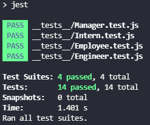

# Team Profile Generator

## Table of Contents
- [**Description**](#-description)
- [**Important Features**](#-important-features)
- [**Installation**](#-installation)
- [**Usage**](#-usage)
- [**License**](#-license)
- [**Tests**](#-tests)
- [**Demo Video**](#-demo-video)
- [**Questions**](#-questions)
- [**Contributing**](#-contributing)
- [**Author**](#-author)

## 📑 Description
As a project manager, don't you want to have a nice team profile page?  
Let my **Team Profile Generator** do that for you!  
Just run my app and type information of you and your team members!

Look at the documentation carefully and grab a wonderful **Team Profile Page** for your team!

The image below is an example of generated **Team Profile Page** based on my input.  
**CLICK** the image below and see the **HTML** code of that page! 

## ❗ Important Features
1. **ONLY** manager accessible program. If you're not a manager, you cannot create the team profile page. Oops!  
  
2. If you don't put **INVALID email**, or if you put nothing for **ID**, **Name**, **office number**, **Github Information**, and **School Information**, the program will warn you to put correctly.
  
3. When you are trying to add employee, you can choose whether **Engineer** or **Intern**.
  
4. When you are done adding one employee, you will be asked to add more employee.
  

## 💾 Installation
Type and run following commands in your terminal.
- **`npm i inquirer`**  
- **`npm i jest`**  

You already have **`inquirer`** and **`jest`** in your **`package.json`**?  
Then just type **`"npm i"`** in your terminal.

## 💻 Usage
For a manager who wants to create a wonderful team profile page for his/her team.  
Type **`node index.js`** in your terminal to run the program.

## 🛠 License
This application is covered by the **MIT** license.

## 📌 Tests
Type and run **`npm run test`** in your terminal, then it will test the following:
  - **`Employee.test.js`**
  - **`Engineer.test.js`**
  - **`Intern.test.js`**
  - **`Manager.test.js`**

## 🎬 Demo Video

If you are unsure of what you need to do? Here is the link of the walkthrough video. Go check it out.  

**CLICK THE PLAY BUTTON**  

## ❔ Questions
🖐 If you have any question about me or my project, feel free to contact me!  
- **Github** Link: [**zzangu0215**](https://github.com/zzangu0215)  
- **Email**: **tajo0215@gmail.com**

## 🔥 Contributing
**Israel Magallon**
  - Portfolio: [**Portfolio**](https://imagallon.github.io/portfolio1.1/) (to be updated)
  - Email: **izzymagallonworks@gmail.com**
  - Github: [**GitHub**](https://github.com/imagallon)

## 😎 Author

- **Jun Park**
    - Portfolio: [**Portfolio**](https://zzangu0215.github.io/portfolio/) (to be updated)
    - Email: **tajo0215@gmail.com**
    - SNS: [**Instagram**](https://www.instagram.com/o0ojunny/)